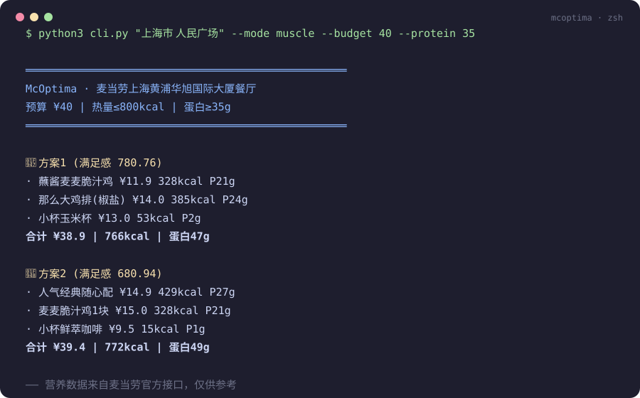
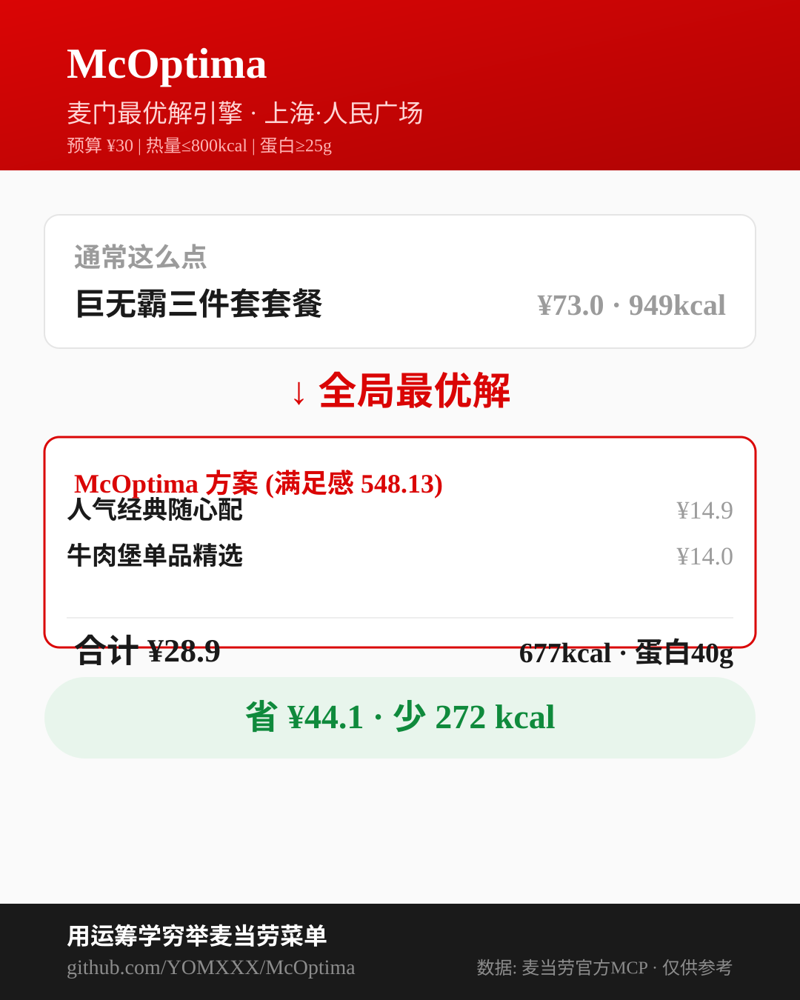

# McOptima - 麦门最优解引擎 🍔

> 用运筹学穷举麦当劳菜单，算出你这张嘴的**全局最优解**。
>
> 预算内满足感最大化 · 控卡平替 · 蛋白下限 · 券后价最优 —— 基于麦当劳官方 MCP 实时数据的多约束 0/1 背包求解器。

[](https://github.com/YOMXXX/McOptima/actions) [](LICENSE) [](MCP_INTEGRATION.md) [](https://github.com/YOMXXX/McOptima/stargazers)

**2026 麦当劳程序员创意开发大赛参赛作品**（非麦当劳官方产品）· 觉得有意思请点个 ⭐ Star 支持参赛！

**在线演示**：[GitHub Pages](https://yomxxx.github.io/McOptima/) · **仓库**：[github.com/YOMXXX/McOptima](https://github.com/YOMXXX/McOptima)

---

## 为什么需要它？

麦当劳 App 只会向你**推销**，不会替你**优化**。

| | App 的推荐 | McOptima 的最优解 |
|---|---|---|
| 立场 | 平台营收最大化 | **你的满足感最大化** |
| 逻辑 | 今天想清什么库存 | 预算×热量×蛋白多约束下的全局最优 |
| 结果 | "要不要加个派只要5块？" | "¥30 预算吃出 742kcal/39g 蛋白，剩余 ¥0.5" |





## 核心能力

```
maximize   Σ 满足感ᵢ · xᵢ              （蛋白质密度 + 性价比 + 品类平衡加权）
subject to Σ 价格ᵢ · xᵢ ≤ 你的预算
           Σ 热量ᵢ · xᵢ ≤ 你的卡路里上限
           Σ 蛋白ᵢ · xᵢ ≥ 你的蛋白下限
           Σ 钠ᵢ · xᵢ ≤ 你的钠上限（可选）
```

- 🥇 **满足感最大化**："只有 30 块，想吃爽" → top-3 组合方案
- 💪 **增肌模式**："今天练完腿要 30g 蛋白" → 蛋白密度排序最优
- 🔁 **平替换算**："想吃巨无霸套餐但不想超 600kcal" → 满足感近似 + 热量更低的替代组合
- 🌙 **深夜补给**：加班场景的宵夜规划（避开睡前咖啡因）
- 👥 **团餐规划**：企业团餐 beType=6 场景 + 助餐服务 + 满减规则

所有数据来自麦当劳官方 MCP（菜单/价格/营养/优惠券），价格以 `calculate-price` 实时计算为准。

## 快速开始

### 方式一：在线 Demo（零配置）

打开 [GitHub Pages 演示页](./demo/index.html)（或本地 `python3 -m http.server` 后访问 `demo/`）——内嵌同算法 JS 求解器 + 86 个真实餐品脱敏数据，拖滑块即出最优解。

### 方式二：命令行（五场景）

```bash
export MCD_MCP_TOKEN=你的Token   # open.mcd.cn/mcp 申请
cd skill/scripts

# 预算内吃爽 (默认 ¥30 / 1200kcal)
python3 cli.py 1450713 --mode feast --budget 30

# 增肌模式 (蛋白≥35g, 支持城市地标自动找店)
python3 cli.py "上海市 人民广场" --mode muscle --budget 40 --protein 35

# 平替换算: 想吃巨无霸但控制在 450kcal 内
python3 cli.py 1450713 --mode sub --target "巨无霸" --kcal 450

# 深夜补给 (22点后自动剔除咖啡因) + 券积分报告
python3 cli.py 1450713 --mode night --coupons
```

### 方式三：WorkBuddy Skill

1. [申请麦当劳 MCP Token](https://open.mcd.cn/mcp)（手机号验证 → 控制台 → 激活）
2. WorkBuddy → 左侧边栏【专家·技能·连接器】→【连接器】→ 右上角【自定义连接器】→【配置MCP】，粘贴：

```json
{
  "mcpServers": {
    "mcd-mcp": {
      "type": "streamablehttp",
      "url": "https://mcp.mcd.cn",
      "headers": {
        "Authorization": "Bearer YOUR_MCP_TOKEN"
      }
    }
  }
}
```

3. 启用 mcd-mcp 连接器，把本仓库 `skill/` 目录放入你的技能目录
4. 对话即用："我在人民广场，预算 30 块，热量别超 800，帮我算最优解"

### 方式四：直接引用求解器

```python
from mcp_client import McdMcpClient, McdService
from build import optimize
from solver import Constraints

svc = McdService(McdMcpClient(), cache_dir="data/cache")
solutions = optimize(
    svc,
    store_code="1450713",           # query-nearby-stores 获取
    constraints=Constraints(budget=30, kcal_cap=800, protein_floor=25),
)
```

## 实测效果（真实数据 · 上海人民广场店 · 2026-10-09）

**预算内吃爽**（¥30 / ≤800kcal / 蛋白≥25g）：

```
🥇 方案1 (满足感 765)
   蘸酱麦麦脆汁鸡 ¥11.9 + 那么大鸡排(椒盐) ¥14.0
   合计 ¥25.9 | 713kcal | 蛋白45g
   对比「巨无霸三件套套餐 ¥36.5/949kcal」→ 省 ¥10.6 · 少 236kcal · 蛋白+14g
```

本地求解总价与 `calculate-price` 官方计算**分毫不差（偏差 ¥0.00）**。

## 项目结构

```
McOptima/
├── skill/
│   ├── SKILL.md             # WorkBuddy Skill 定义（含安全规则/工具分层/双确认）
│   └── scripts/
│       ├── mcp_client.py    # 麦当劳 MCP 客户端（JSON-RPC over Streamable HTTP）
│       ├── solver.py        # 多约束 0/1 背包 DP 求解器（三维：预算×热量×蛋白）
│       ├── build.py         # 数据装配（菜单+营养+价格 → FoodItem）
│       ├── substitute.py    # 平替换算器
│       ├── coupon_planner.py# 券与积分规划
│       ├── card_generator.py# SVG 分享卡生成器
│       └── cli.py           # 命令行工具（五场景）
├── tests/                   # 单元测试（8 用例，离线可跑）
├── demo/                    # GitHub Pages 演示页（JS 同算法求解器）
├── data/                    # 本地缓存（已 gitignore，不入库）
├── assets/                  # 分享卡/演示图
└── .github/workflows/       # CI: 测试 + 必交文件检查 + Token 泄露守卫
```

## 技术细节

- **算法**：二维约束 0/1 背包（预算 ¥1 粒度 × 热量 10kcal 粒度），复数份餐品展开为虚拟条目并做满足感衰减（×0.9^n），top-k 方案通过「禁用重解」迭代产出。菜单约百级条目，毫秒级出解。
- **数据链路**：`query-meals`（菜单）→ `calculate-price`（批量价格）→ `query-meal-detail`（套餐结构）→ `list-nutrition-foods`（158 项营养表，名称归一化模糊匹配 + 套餐默认选择加总）。
- **限流兼容**：官方 600 req/min，本地令牌桶窗口保护 + 三级缓存（菜单 1h / 价格实时 / 营养 24h）。
- **交易安全**：`create-order` 等交易类工具启用双确认机制（方案展示 → 用户确认 → 金额 >¥150 二次复述），金额阈值硬编码于 SKILL.md，不可被提示词注入覆盖。

## 免责声明

本项目为 2026 麦当劳程序员节创意开发大赛参赛作品，由参赛者独立开发，非麦当劳官方产品。营养数据来自麦当劳官方接口，仅供参考，不构成医疗或营养建议；餐品信息、价格及供应状态以麦当劳官方渠道实时结果为准。

## License

MIT
